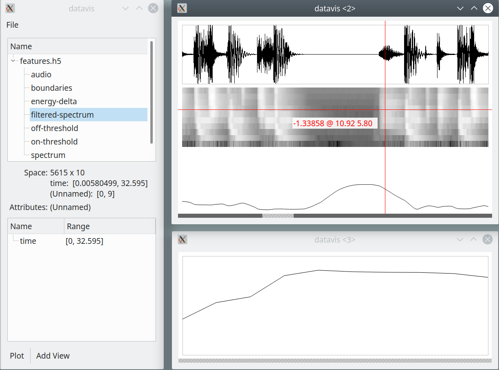

Datavis: Visual data explorer
##############################

Datavis is an application for visual exploration of numerical data. Rather than creating beautiful visualizations for presentation, its purpose is to **explore data and gain insights**. The goal is to go from data to a basic, straightforward visualization **within seconds**. In addition, alternative, more detailed and interest-specific visualization should be available.

On the more technical side, the goals of this software are:

- Load numerical data from a variety of input formats.
- Represent data with a simple, generic and intuitive data model.
- Visualize data in a variety of ways, with an intuitive mapping between the data model and the visualization.
- Navigate over the visualization quickly and efficiently (zooming, scrolling, etc.)
- Visually compare data within and across data sets with ease.
- Update visualization with new data easily.
- Handle large data sets efficiently.

This project is still in an early stage of development. A lot of work remains to be done to meet these goals.

A screenshot of Datavis in action:

